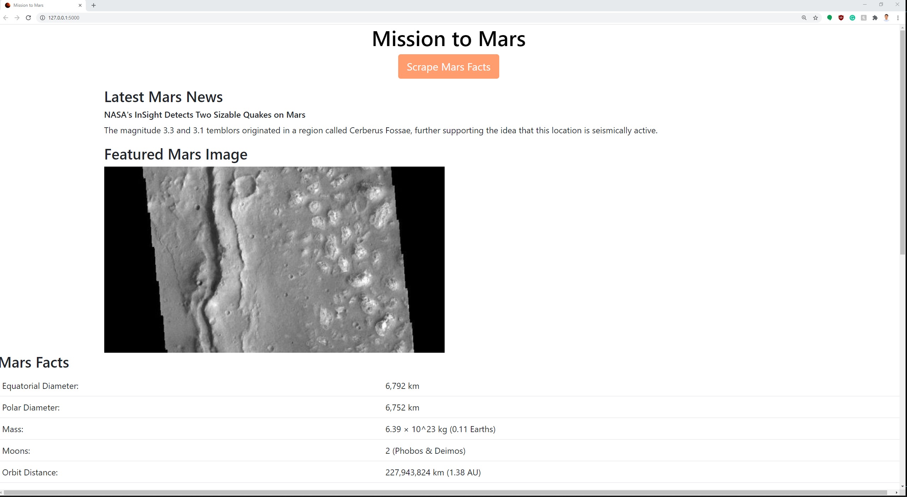
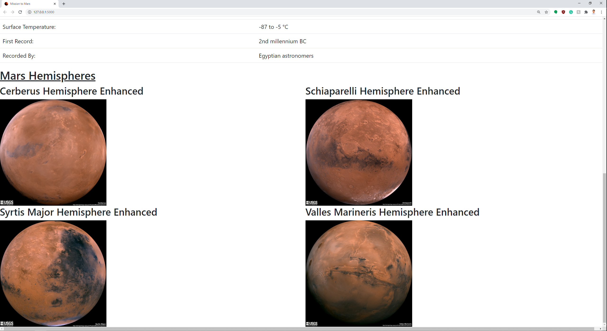

# web-scraping-challenge
This challenge will interact with [NASA Mars](https://mars.nasa.gov/news/?page=0&per_page=40&order=publish_date+desc%2Ccreated_at+desc&search=&category=19%2C165%2C184%2C204&blank_scope=Latest), [Jet Propulsion Laboratory](https://data-class-jpl-space.s3.amazonaws.com/JPL_Space/index.html), [Space-Facts](https://space-facts.com/mars/), and [Astrogeology.gov](https://astrogeology.usgs.gov/search/results?q=hemisphere+enhanced&k1=target&v1=Mars)

* I will be using flask to route python app that scrapes the above websites for Mars information.
    * NASA Mars scraping points to the first headline and article snippet. 
    * JPL clicks into the featured image and grabs the URL
    * Space Facts grab the relevant Mars facts on the website and leaves out Earth Facts
    * Astrogeology website grabs the clicks through the 4 different hemisphere of Mars and stores the URL of the images to be displayed.

